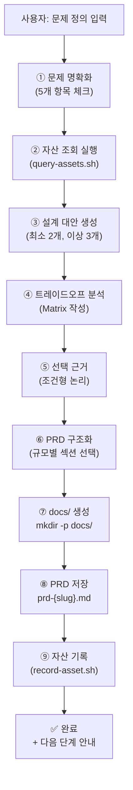
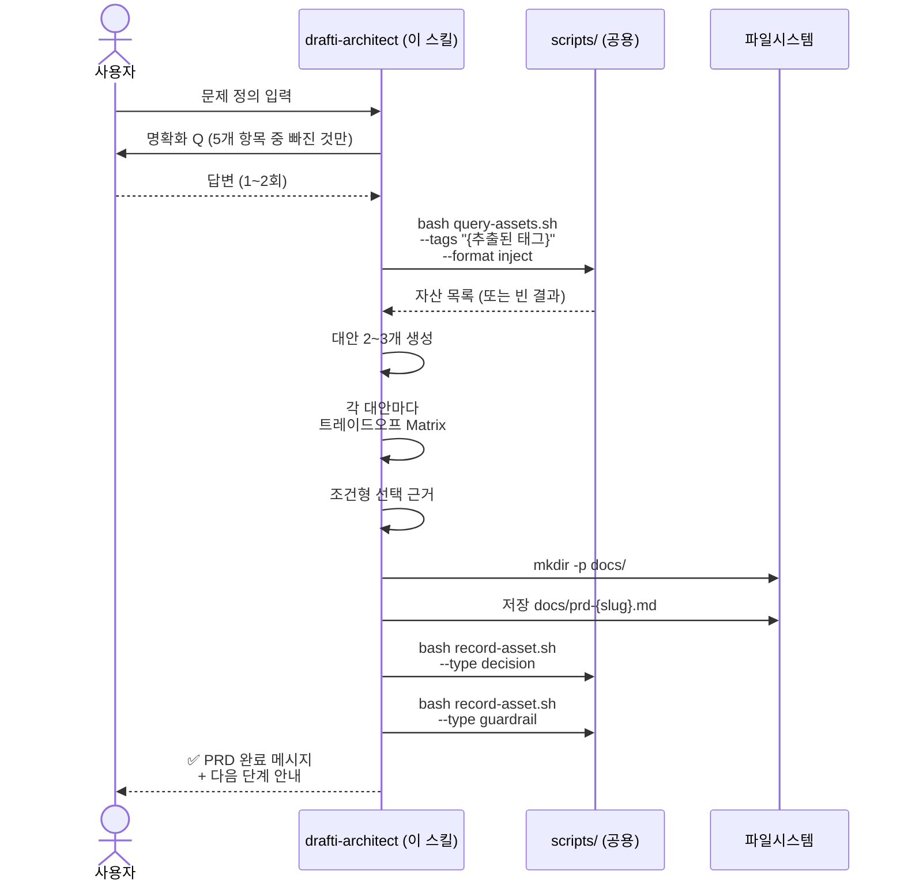

# drafti-architect — 기술 설계 PRD 생성기

기획 문서 없이 기술적 문제 정의만으로 구현 가능한 PRD를 생성하는 스킬.
저수준 LLM이 기계적으로 따를 수 있도록 구체적 규칙, 체크리스트, bash 명령을 포함한다.

## 실행 체크리스트 (START HERE)

이 체크리스트를 위에서 아래로 순차 실행하면 PRD가 완성된다.

- [ ] **1단계**: 문제 정의 입력받기 (사용자로부터)
- [ ] **2단계**: 명확화 질문 5개 항목 검사 (§2 참조)
- [ ] **3단계**: 기존 자산 쿼리 (bash: query-assets.sh)
- [ ] **4단계**: 설계 대안 2~3개 탐색 (결정표 사용: §4 참조)
- [ ] **5단계**: 각 대안별 트레이드오프 분석 (표 형식: §4.2)
- [ ] **6단계**: 선택 근거 + 유효 조건 기술
- [ ] **7단계**: PRD 구조화 (규모별 섹션 결정: §5)
- [ ] **8단계**: docs/prd-{slug}.md 저장 (존재 확인 + mkdir)
- [ ] **9단계**: decision/guardrail 자산 기록 (bash: record-asset.sh)
- [ ] **10단계**: 완료 안내 제시

---

## 1. 전체 흐름



### PRD 생성 시퀀스



## 2. 문제 명확화 단계 (CONCRETE CHECKLIST)

### 검사 항목 (5개 - 반드시 확인)

다음 5개 항목을 순서대로 검사한다. 사용자 입력에서 이미 답이 있으면 ✅, 없으면 질문 목록에 추가한다.

| # | 항목 | 검사 기준 | 사용자 입력에 있음? |
|---|------|---------|-----------------|
| 1 | 문제 정의 | "무엇이 문제인가" + "현재 상태의 구체적 고통점" 이 명시되었는가? | ✅ 또는 ❌ |
| 2 | 긴급도/임팩트 | "왜 지금 해결해야 하는가" + "해결했을 때 얻는 것" 이 명시되었는가? | ✅ 또는 ❌ |
| 3 | 기술 제약 | "사용 가능한 기술 스택" 또는 "호환성 요구사항"이 명시되었는가? (없으면 "제약 없음"으로 진행) | ✅ 또는 ❌ |
| 4 | 범위 | "이번에 반드시 해결할 것" vs "나중으로 미룰 것"이 구분되었는가? | ✅ 또는 ❌ |
| 5 | 성공 기준 | "완성됐다"를 어떻게 판정하는가? (테스트, 메트릭, 사용성 기준 등) | ✅ 또는 ❌ |

### 실행 규칙

1. **5개 항목을 모두 검사한다.** (한 번에 모든 것을 묻지 말 것)
2. **❌인 항목만 사용자에게 질문한다.** (✅인 항목은 건너뛴다)
3. **1~2개씩 나누어 묻되, 총 2회 이내로 완료한다.** (3회 이상 Q&A는 피한다)
4. **사용자가 응답하지 않은 항목은 "[미확인]" 표기하고 기존 정보로 진행한다.**

## 3. 기존 자산 참조 (BASH INTEGRATION)

### 태그 추출 규칙

문제 정의에서 다음 우선순위로 태그를 추출한다. (태그 3~5개, 소문자 영문 케밥케이스)

1. **기술 스택**: docker, react, prisma, kubernetes, fastapi, postgres 등
2. **문제 도메인**: cache, auth, logging, monitoring, deployment, database 등
3. **작업 유형**: build, deploy, test, optimize, refactor, integrate 등

예시: 문제="Docker 캐시 레이어 최적화" → 태그: `docker,cache,build`

### 자산 쿼리 실행

```bash
# HARNISH_ROOT 감지 (모노리포 vs 독립 설치)
if [[ -f "${CLAUDE_SKILL_DIR}/../../scripts/query-assets.sh" ]]; then
  HARNISH_ROOT="${CLAUDE_SKILL_DIR}/../.."
else
  HARNISH_ROOT=""
fi

if [[ -n "$HARNISH_ROOT" ]]; then
  bash "$HARNISH_ROOT/scripts/query-assets.sh" \
    --tags "{추출된 태그 3~5개}" \
    --format inject \
    --base-dir "$HARNISH_ROOT/_base/assets"
else
  echo "ℹ️ 독립 모드: 자산 조회 비활성. 기존 자산 없이 진행."
fi
```

### 결과 처리

- **성공 (자산 발견)**: 결과를 PRD §8에 "기존 자산 참조" 섹션으로 포함
  - guardrail 타입 → §7 가드레일에 병합
  - decision 타입 → §2 설계 결정의 "선택 근거" 보강
  - pattern 타입 → §4 구현 명세에 추가
  - failure 타입 → §5 엣지케이스/위험 영역에 추가
- **빈 결과 (자산 없음)**: 자산 없이 진행. PRD §8에 "기존 자산 없음" 기록
- **쿼리 오류**: 자산 조회 스킵, PRD 생성 계속 진행

## 4. 설계 결정 작성 (DECISION TABLE + TRADE-OFF MATRIX)

PRD의 핵심은 §2 설계 결정이다. 이 규칙을 기계적으로 따르면 고품질 결정이 나온다.

### 4.1 대안 생성 규칙 (CONCRETE)

| 상황 | 행동 | 예시 |
|------|------|------|
| "명백한 정답이 있다"고 생각함 | **반드시 2개 이상 대안 만들기** | A가 정답 → A의 단점 + B(현상유지 또는 다른 접근) 비교 |
| 기술 선택 문제 | 최소 2개 (선택지가 많으면 3개) | React vs Vue, Docker vs VM |
| 아키텍처 결정 | 최소 2개 (복잡하면 3개) | 마이크로서비스 vs 모놀리식 |
| 요구사항이 명확함 | 2개면 충분 | |
| 요구사항이 불명확함 | 3개 권장 (트레이드오프 더 명확) | |

**규칙**: 모든 경우 최소 2개, 이상적으로 3개 대안 제시. 절대 1개만으로 끝내지 말 것.

### 4.2 트레이드오프 분석 (MATRIX FORMAT)

각 대안마다 이 표를 만든다. (Markdown 표 형식)

```
## §2.1 대안 A: {대안 이름}

| 측면 | 평가 |
|------|------|
| **장점** | (정량화) - 해석 |
| **단점** | (정량화) - 해석 |
| **구현 난이도** | 낮음/중간/높음 + 이유 |
| **러닝 커브** | 팀이 학습하는 데 필요한 시간 |
| **적합한 상황** | "언제 이것이 최선인가" |
| **기각 조건** | "언제 이것을 쓰면 안 되는가" |
```

### 4.3 선택 근거 (CONDITIONAL LOGIC)

선택 이유를 반드시 조건형으로 쓴다:

**나쁜 예**: "React가 더 낫다"
**좋은 예**: "우리 팀의 React 경험(2년) + 기존 프로젝트 기여도(80%)를 고려하면, 학습 비용 제로. Vue를 쓰려면 3주 학습 필요. 따라서 React 선택."

필수 요소:
1. 현재 상황 명시 (팀 수준, 기술 스택, 시간 제약 등)
2. 선택으로 얻는 것 (시간, 비용, 품질)
3. 유효 조건 명시 ("이 조건이 바뀌면 재검토")

## 5. PRD 구조화 (SIZE-BASED DECISION TABLE)

PRD 파일명 결정: `prd-{kebab-case-slug}.md`
슬러그 도출 규칙: 프로젝트명 또는 핵심 기술 키워드 (예: docker-cache-optimization → prd-docker-cache.md)

### 규모별 섹션 선택 (MANDATORY)

| 프로젝트 규모 | 예상 시간 | 필수 섹션 | 선택 섹션 | 생략 섹션 |
|-----------|---------|----------|----------|----------|
| **소** | 1~2일 | §1(목표), §2(설계결정), §4(구현명세), §6(테스트), §7(가드레일) | §3, §5 | §8+ |
| **중** | 1~2주 | 전체 (§1~§8) | §9(부록) | - |
| **대** | 1개월+ | 전체 §1~§8 + **페이즈별 분할** | 페이즈별 일정표 | - |

### 규모 판단 기준

| 규모 | 판단 기준 |
|------|---------|
| 소 | 구현 코드 라인 수 추정 < 500줄, 또는 1인 1~2일 |
| 중 | 구현 코드 500~2000줄, 또는 1인 1~2주 |
| 대 | 구현 코드 2000줄+, 또는 팀 1개월+, 또는 페이즈 분할 필요 |

**규칙**: 불명확하면 중규모로 가정. 나중에 섹션을 줄이는 것이 나중에 추가하는 것보다 쉽다.

## 6. 산출물 저장 (FILE OPERATIONS)

### 디렉토리 생성

```bash
mkdir -p docs/
```

### PRD 파일 저장

```bash
cat > docs/prd-{slug}.md << 'EOF'
# [PRD 내용을 여기에 쓴다]
EOF
```

### 자산 기록 (decision + guardrail)

주요 설계 결정과 발견된 가드레일을 공용 스크립트로 저장한다.

```bash
if [[ -n "$HARNISH_ROOT" ]]; then
  # Decision 자산 기록
  bash "$HARNISH_ROOT/scripts/record-asset.sh" \
    --type decision \
    --tags "{추출된 태그}" \
    --context "prd-{slug}: {선택한 대안 이름}" \
    --title "{결정 사항 한 줄}" \
    --content "{선택 근거 요약}" \
    --base-dir "$HARNISH_ROOT/_base/assets"

  # Guardrail 자산 기록 (도출된 제약이 있는 경우)
  bash "$HARNISH_ROOT/scripts/record-asset.sh" \
    --type guardrail \
    --tags "{추출된 태그}" \
    --context "prd-{slug}: {제약 맥락}" \
    --title "{규칙 한 줄}" \
    --content "{위반 시 결과}" \
    --base-dir "$HARNISH_ROOT/_base/assets"
else
  echo "ℹ️ 독립 모드: 자산 기록 비활성. PRD만 저장됨."
fi
```

## 7. 완료 안내

PRD 완성 후 이 메시지를 사용자에게 제시한다:

```
✅ PRD가 완성되었습니다: docs/prd-{slug}.md

포함된 섹션:
✓ §4 구현 명세 (파일별 변경 사항)
✓ §6 테스트 기준 (acceptance criteria)
✓ §7 가드레일 (prohibitions + guardrails)

다음 단계:
- PRD를 검토하신 후 "구현 시작" 또는 "태스크 분해"를 요청하세요.
- 검증이 필요하면 /ralphi로 PRD 정합성을 확인할 수 있습니다.
```

## 8. drafti-feature와의 구분 (DECISION TREE)

| 사용자 요청 | 의사결정 | 사용할 스킬 |
|-----------|--------|-----------|
| "이 기획서를 기반으로 PRD 만들어" | 기획 문서가 이미 존재함 | → **drafti-feature** |
| "이 문제를 어떻게 해결할지 설계해" | 기획이 없고 설계 판단 필요 | → **drafti-architect** |
| "Docker 캐시 최적화 어떻게 할까?" | 기술 문제 정의만 있음 | → **drafti-architect** |
| "새 인증 시스템 만들기" (명세서 첨부) | 명세서 = 기획 문서 | → **drafti-feature** |

**규칙**: 기획 문서 有/無로 판단하는 것이 가장 단순. 의심스러우면 사용자에게 "기획 문서가 있나요?"로 확인.

## 9. 맥락 예산 관리 (CONTEXT BUDGET)

| 시점 | 읽는 파일 | 읽지 않는 파일 |
|------|----------|-------------|
| **시작** | 사용자 입력만 | references/ 전체 (아직 불필요) |
| **§3 자산 조회** | query-assets.sh 결과 (inject) | 자산 원본 파일 (inject가 요약) |
| **§4 설계 결정** | `references/design-decision.md` | `references/prd-template.md` (아직 불필요) |
| **§5 PRD 구조화** | `references/prd-template.md` | `references/design-decision.md` (이미 사용 완료) |
| **§6 저장** | 없음 (이미 작성된 내용 사용) | references/ 전체 |

**규칙**: references/ 파일은 **동시에 1개만** 읽는다. 위 표의 "시점" 열이 지정된 단계에서만 읽고, 다음 단계로 넘어갈 때 전환.
