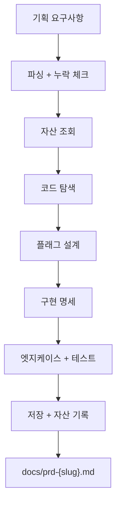

# drafti-feature — 피쳐 PRD 생성기

기획 요구사항을 구현 가능한 명세 PRD로 변환. drafti-architect와 달리 "어떻게 만드는가"에 집중.

**drafti-architect vs drafti-feature**: 기획 문서 제공 → drafti-feature / 미제공 → drafti-architect

## 실행 순서

1. ✓ 기획 요구사항 파싱 (§2)
2. ✓ 기존 자산 조회 (§3)
3. ✓ 코드베이스 탐색 (§4)
4. ✓ 피쳐플래그 설계 (§5)
5. ✓ 구현 명세 작성 (§6)
6. ✓ 엣지케이스·테스트 도출 (§7)
7. ✓ PRD 저장 및 자산 기록 (§8)

## 1. 전체 흐름



## 2. 요구사항 파싱

**필수 4가지 추출:**

| 항목 | 내용 |
|-----|------|
| 핵심 기능 | 사용자에게 보이는 변화 (1~3줄) |
| 성공 지표 | KPI/목표 (수치 또는 조건) |
| 사용자 흐름 | Happy path + 분기 |
| 비기능 요구사항 | 성능, 보안, 접근성 |

**누락 확인**: 4가지 중 1~2개 빠졌으면 사용자에게 확인 후 진행. 모두 있으면 다음 단계.

## 3. 기존 자산 조회

**명령어** (핵심 키워드 3~5개 추출 후 실행):

```bash
if [[ -f "${CLAUDE_SKILL_DIR}/../../scripts/query-assets.sh" ]]; then
  HARNISH_ROOT="${CLAUDE_SKILL_DIR}/../.."
else
  HARNISH_ROOT=""
fi

if [[ -n "$HARNISH_ROOT" ]]; then
  # 롤아웃 패턴 (성공 사례)
  bash "$HARNISH_ROOT/scripts/query-assets.sh" \
    --tags "{키워드_1},{키워드_2}" --types "pattern" --format inject \
    --base-dir "$HARNISH_ROOT/_base/assets"

  # 실패 사례
  bash "$HARNISH_ROOT/scripts/query-assets.sh" \
    --tags "{키워드_1},{키워드_2}" --types "failure" --format inject \
    --base-dir "$HARNISH_ROOT/_base/assets"

  # 피쳐플래그 컨벤션
  bash "$HARNISH_ROOT/scripts/query-assets.sh" \
    --tags "feature-flag,convention" --types "guardrail" --format inject \
    --base-dir "$HARNISH_ROOT/_base/assets"
else
  echo "ℹ️ 독립 모드: 자산 조회 비활성. 기본 규칙으로 진행."
fi
```

**결과**: 자산 있으면 참고, 없어도 기본 규칙(§5 롤아웃 전략 + 킬스위치)으로 진행.

## 4. 코드베이스 탐색

> 아래 명령은 프로젝트 언어에 맞게 조정한다.
> 소스 루트(`src/`, `app/`, `lib/` 등)와 확장자를 프로젝트에 맞게 변경.

**Step 0: 언어 감지** (프로젝트 설정 파일로 판별)
```bash
# 존재하는 설정 파일로 주 언어 판별
ls package.json tsconfig.json 2>/dev/null && echo "→ JS/TS 프로젝트"
ls pyproject.toml setup.py requirements.txt 2>/dev/null && echo "→ Python 프로젝트"
ls go.mod 2>/dev/null && echo "→ Go 프로젝트"
ls Cargo.toml 2>/dev/null && echo "→ Rust 프로젝트"
ls build.gradle pom.xml 2>/dev/null && echo "→ Java/Kotlin 프로젝트"
```

**Step 1: 파일 검색** (핵심 키워드 각각, 언어별 확장자)
```bash
# Python 예시 (기본)
grep -rn "{keyword}" . --include="*.py" -l | head -20

# TypeScript/JS 프로젝트 시
# grep -rn "{keyword}" src/ --include="*.ts" --include="*.tsx" --include="*.js" -l | head -20

# Java 프로젝트 시
# grep -rn "{keyword}" src/ --include="*.java" --include="*.kt" -l | head -20
```

**Step 2: 파일명 패턴**
```bash
find . -name "*[Kk]{keyword}*" -type f -not -path "*/node_modules/*" -not -path "*/.venv/*" -not -path "*/target/*" | head -20
```

**Step 3: 데이터 모델** (언어별 타입 정의 패턴)
```bash
# Python: class, TypedDict, dataclass, Pydantic model
grep -rn "class.*{Keyword}\|{Keyword}.*BaseModel\|{Keyword}.*TypedDict" . --include="*.py" | head -10

# TypeScript: interface, type
# grep -rn "interface.*{Keyword}\|type.*{Keyword}" src/ --include="*.ts" --include="*.tsx" | head -10

# Java/Kotlin: class, record, data class
# grep -rn "class.*{Keyword}\|record.*{Keyword}" src/ --include="*.java" --include="*.kt" | head -10
```

**결과 기록**: 영향 파일 + 데이터 모델 변경 여부 (→ PRD §3에 반영)

## 5. 피쳐플래그 설계

**플래그 키**: `{feature_name}_enabled` 또는 `{feature_name}_{scope}_enabled` (예: `user_profile_edit_enabled`)
- §3 자산에 팀 컨벤션 있으면 따름, 없으면 기본 규칙 사용

**롤아웃 전략 선택:**

| 조건 | 전략 | 스케줄 | 모니터 지표 |
|------|------|--------|----------|
| UI만 변경 | 비율 기반 | 10% → 50% → 100% | 에러율 |
| 데이터 모델 변경 | 세그먼트 기반 | 내부 → 베타 → 전체 | 에러율 + 완성도 |
| 결제/금융 | 최소단위 + 수동승인 | 1명 → 10명 → 비율 | 금융오류 |
| 성능 영향 가능 | 비율 + 성능게이트 | 5% → 10% → 100% | 에러율 + p99 |
| 외부 API | 비율 + 타임아웃 | 5% → 20% → 100% | 에러율 + 응답시간 |

**킬스위치 (필수)**:
- 모니터 지표 + 임계치 (기본: 에러율 > 1%, p99 > 500ms)
- 발동: 자동 롤백

## 6. 구현 명세 작성 (PRD §4)

**태스크 분해의 기반이 되므로, 파일 경로·함수·분기 위치를 구체적으로 명시해야 함.**

**§4.1 파일별 변경**: 경로 | 변경유형 | 설명 | 플래그분기
```markdown
| src/components/ProfileEdit.tsx | 수정 | 프로필 편집 UI | 필요 |
| src/api/profile.ts | 수정 | 저장 API | 필요 |
| src/types/profile.ts | 수정 | User 타입 확장 | 불필요 |
```

**§4.2 함수/컴포넌트 변경**: 입력 | 출력 | 동작 단계
```markdown
**ProfileEdit.tsx** (새)
- 입력: userId, onSave
- 동작: 폼 렌더링 → 검증 → API 호출 → 콜백
```

**§4.3 플래그 분기**: 파일 | 함수 | 위치 | 조건 (파일:라인 수준 구체성)
```markdown
| src/components/UserProfile.tsx | UserProfile() | 라인 45 | if (flags.user_profile_edit_enabled) { ... } |
```

**§4.4 데이터 모델**: DB 스키마 변경이 있는 경우에만 작성. 추가 필드 + 마이그레이션 전략 + 롤백 안전성. 변경 없으면 "해당 없음" 기입.

## 7. 엣지케이스 & 테스트 (PRD §5, §6)

**검증 기준의 핵심. 플래그 상태별로 분리해야 누락 없이 테스트 가능.**

**§5 엣지케이스**:
```markdown
### 플래그 ON
- 새 UI 정상 렌더링
- 이미지 128KB 초과 시 에러 표시
- 네트워크 오류 시 재시도
- 입력 중 탭 닫기 → 경고

### 플래그 OFF
- 편집 버튼 미표시
- 직접 API 호출 → 403 또는 비활성화
- 기존 흐름 100% 동일

### 부분 롤아웃 (10%)
- 세션 중 일관된 플래그 상태 유지
- 캐시된 플래그 5분 이상 오래되지 않음
```

**§6 테스트 기준** (Acceptance Criteria):
```markdown
### ON 상태
- [ ] 폼 렌더링
- [ ] 입력 + 저장
- [ ] API 호출
- [ ] 128KB 초과 에러
- [ ] 네트워크 재시도

### OFF 상태
- [ ] 버튼 미표시
- [ ] /edit 직접 접근 → 리다이렉트
- [ ] 회귀 테스트

### 롤백
- [ ] OFF 상태 모든 테스트 통과
- [ ] ON에서 저장한 데이터 OFF에서도 표시
- [ ] 롤백 후 신규 사용자 기존 흐름
```

## 8. PRD 저장 및 자산 기록

**경로**: `docs/prd-{slug}.md` (예: "사용자 프로필 편집" → `prd-user-profile-edit.md`)

**PRD 8섹션**:
| 섹션 | 내용 |
|------|------|
| §1 | 기획 요약 (원본 참조) |
| §2 | 플래그 설계 (키, 롤아웃, 킬스위치) |
| §3 | 기술 설계 (영향 파일) |
| §4 | 구현 명세 (파일변경, 함수, 분기, 모델) |
| §5 | 엣지케이스 (ON/OFF/부분) |
| §6 | 테스트 기준 (Acceptance Criteria) |
| §7 | 가드레일 (필수/금지/권장) |
| §8 | 자산 참조 |

**§7 가드레일 (필수 포함)**:
```markdown
### 필수
- 플래그 키: {키명}
- 롤아웃: 10% → 50% → 100%
- 킬스위치: 에러율 > 1% 시 자동 롤백
- OFF 상태 기존동작 100% 보존

### 금지
- 기획 없이 플래그 추가 금지
- 킬스위치 없이 100% 롤아웃 금지
- 1주일 이전 코드 정리 금지

### 권장
- 단계별 메트릭 리뷰
- 주 단위 진행 판단
```

**자산 기록 (생태계 모드에서만)**:
```bash
if [[ -n "$HARNISH_ROOT" ]]; then
  # 패턴 기록
  bash "$HARNISH_ROOT/scripts/record-asset.sh" \
    --type pattern --tags "{키워드},{롤아웃}" --context "{피쳐명}" \
    --title "롤아웃 패턴: {피쳐명}" --content "[스케줄]" \
    --base-dir "$HARNISH_ROOT/_base/assets"

  # 가드레일 기록
  bash "$HARNISH_ROOT/scripts/record-asset.sh" \
    --type guardrail --tags "{키워드},feature-flag" --context "{피쳐명} 가드레일" \
    --title "§7 가드레일: {피쳐명}" --content "[PRD §7 전문]" \
    --base-dir "$HARNISH_ROOT/_base/assets"
fi
```

## 9. 오류 처리

| 증상 | 대응 |
|------|------|
| 기획 문서 핵심 불분명 | 사용자 확인: 핵심기능 + 성공기준 + 흐름 (3개 모두 필수) |
| 코드 탐색 0건 | "새 경로인가?" 또는 다른 패턴 확인 후 재탐색. "미정"으로 기록 후 진행 |
| 자산 없음 | 기본 규칙 사용 (경고 없음) |
| docs/ 없음 | `mkdir -p docs` |
| 스크립트 오류 | `ls -la` 확인 + `chmod +x` + `mkdir -p _base/assets` |

## 10. 완료 후

**PRD 저장 후 사용자에게**:
```
✓ PRD 생성: docs/prd-{slug}.md

포함된 섹션:
✓ §4 구현 명세 (파일별 변경 + 플래그 분기)
✓ §6 테스트 기준 (ON/OFF/롤백)
✓ §7 가드레일 (필수/금지/권장)

다음 단계:
- 검토 후 "구현 시작" 또는 "태스크 분해"를 요청하세요.
- 검증이 필요하면 /ralphi로 PRD 정합성을 확인할 수 있습니다.
```

## 11. 맥락 예산 관리 (CONTEXT BUDGET)

| 시점 | 읽는 파일 | 읽지 않는 파일 |
|------|----------|-------------|
| **§2 요구사항 파싱** | 기획서만 | references/ 전체, 코드베이스 |
| **§3 자산 조회** | query-assets.sh 결과 (inject) | 자산 원본, 기획서 원문 (이미 파싱 완료) |
| **§4 코드 탐색** | grep 결과 파일만 (head -20) | 전체 src/ (grep 결과 외 불필요) |
| **§5 플래그 설계** | `references/feature-flag-patterns.md` | `references/prd-template.md` |
| **§6 구현 명세** | `references/prd-template.md` + §4 탐색 결과 | feature-flag-patterns (이미 사용 완료) |

**규칙**: references/ 파일은 **동시에 1개만**. grep 결과는 `head -20`으로 제한. 코드 파일 읽기는 영향 파일만.
